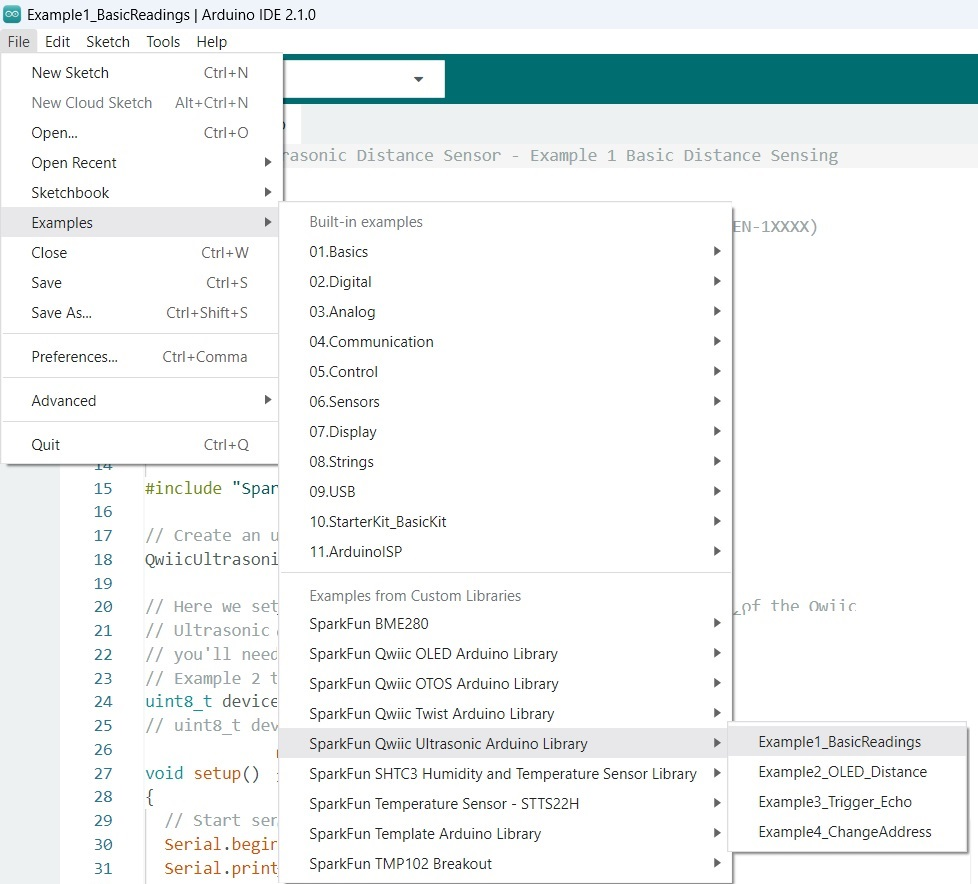
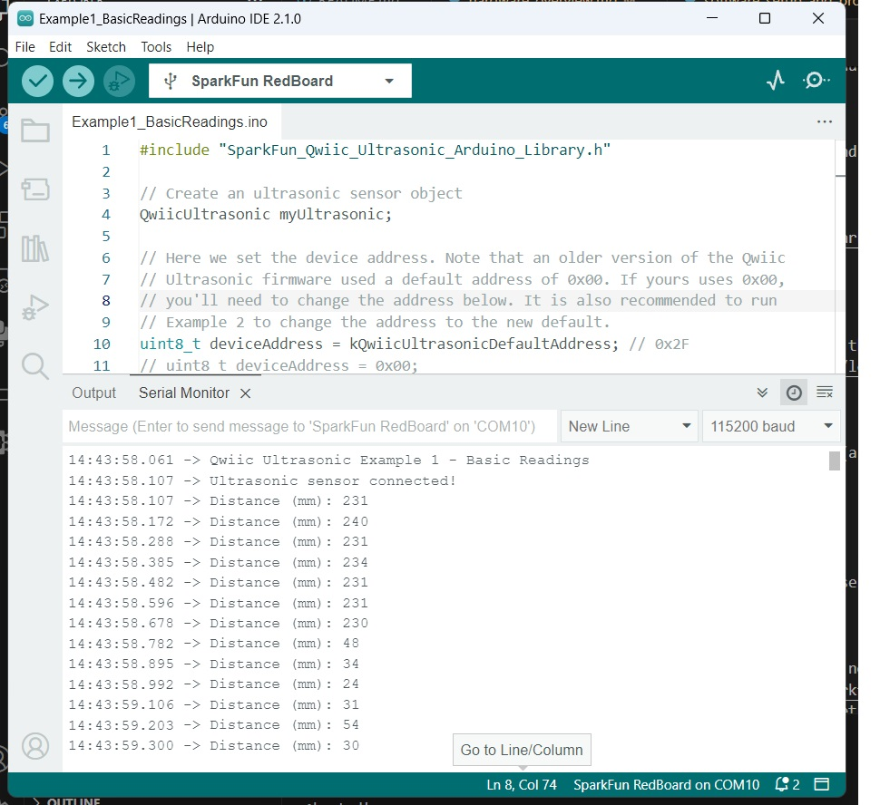
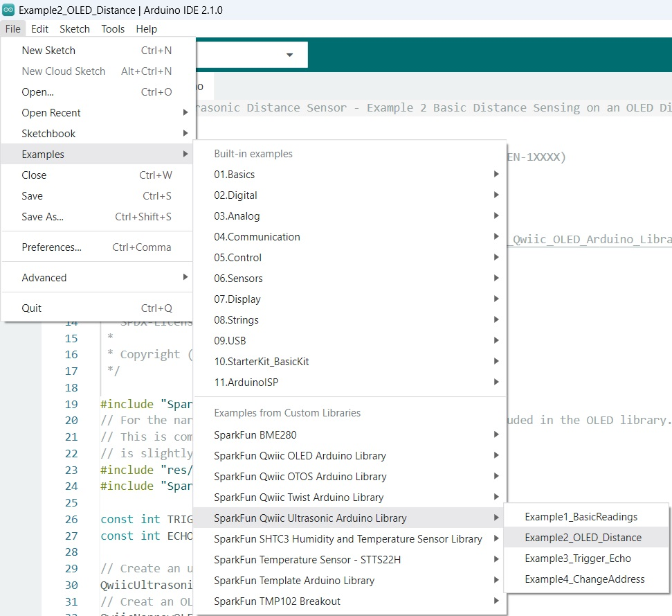
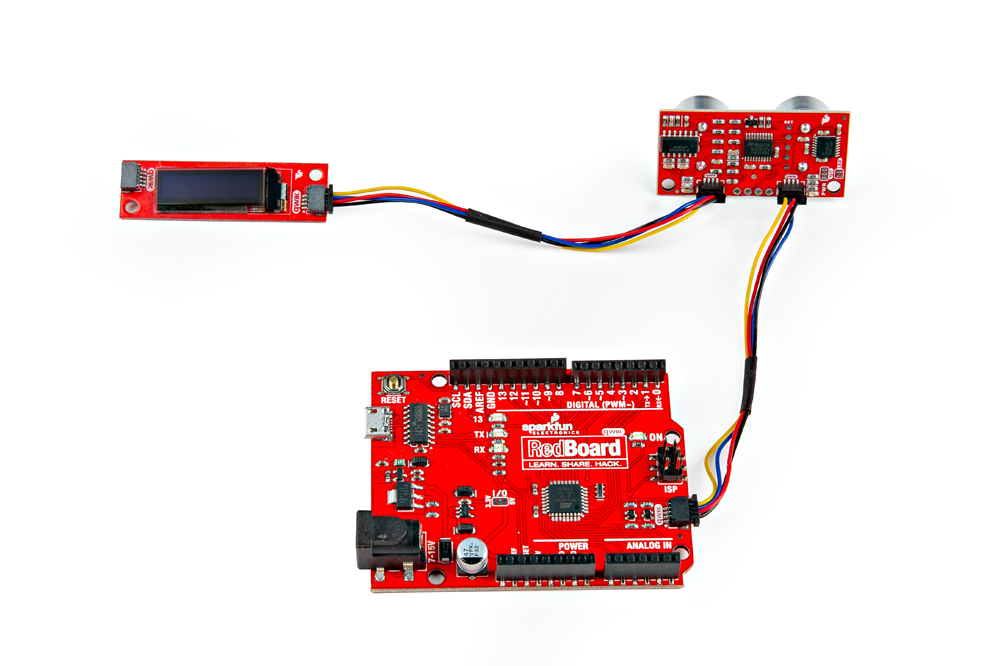

Now that we've installed the Arduino library, it's time to upload our first sketch to make sure everything is working properly.


###Example 1

This first example just does some basic measurements. To find Example 1, go to **File** > **Examples** > **SparkFun Qwiic Ultrasonic Arduino Library** > **Example1_BasicReadings**:


<figure markdown>
[{ width="90%" }](assets/img/Example1_Menu.jpg "Click to enlarge")
<figcaption markdown>Finding Example 1</figcaption>
</figure>

Alternatively, you can expand the link below and copy and paste the code into a shiny new Arduino sketch: 

??? "Example 1 Arduino Code"
	```
	--8<-- "https://raw.githubusercontent.com/sparkfun/SparkFun_Qwiic_Ultrasonic_Arduino_Library/v10/examples/Example1_BasicReadings/Example1_BasicReadings.ino"
	```


Make sure you've selected the correct board and port in the Tools menu and then hit the upload button. Once the code has finished uploading, go ahead and open a [Serial Monitor](https://learn.sparkfun.com/tutorials/terminal-basics). You should see something similar to the following. 

<figure markdown>
[{ width="90%" }](assets/img/Example1_Output.jpg "Click to enlarge")
<figcaption markdown>Example 1 Output</figcaption>
</figure>

Note the output change when the mouse is moved closer to the sensor. 


### Example 2

Let's add in an LCD screen to display our measurements. 

To display the sensor readings on the connected Qwiic OLED, we will need to install the SparkFun Qwiic OLED library. You can install this library to automatically in the Arduino IDE's Library Manager by searching for "**SparkFun Qwiic OLED**". Or you can manually download it from the [GitHub repository](https://github.com/sparkfun/SparkFun_Qwiic_OLED_Arduino_Library). 

<center>
	[Download the SparkFun Qwiic OLED Library (ZIP)](https://github.com/sparkfun/SparkFun_Qwiic_OLED_Arduino_Library/archive/refs/heads/main.zip){ .md-button .md-button--primary }
</center>


<!-- use three Adafruit libraries:

* [Adafruit BusIO GitHub](https://github.com/adafruit/Adafruit_BusIO)
* [Adafruit GFX GitHub](https://github.com/adafruit/Adafruit-GFX-Library)
* [Adafruit SSD1306 GitHub](https://github.com/adafruit/Adafruit_SSD1306)

#### Adafruit BusIO Library

You can install this library to automatically in the Arduino IDE's Library Manager by searching for "**Adafruit BusIO**". Or you can manually download it from the [GitHub repository](https://github.com/adafruit/Adafruit_BusIO). 


<center>
	[Download the Adafruit BusIO Library (ZIP)](https://github.com/adafruit/Adafruit_BusIO/archive/master.zip){ .md-button .md-button--primary }
</center>


#### Adafruit GFX Library

You can install this library to automatically in the Arduino IDE's Library Manager by searching for "**Adafruit GFX**". Or you can manually download it from the [GitHub repository](https://github.com/adafruit/Adafruit-GFX-Library). 

<center>
	[Download the Adafruit GFX Library (ZIP)](https://github.com/adafruit/Adafruit-GFX-Library/archive/master.zip){ .md-button .md-button--primary }
</center>


#### Adafruit SSD1306 Library

You can install this library to automatically in the Arduino IDE's Library Manager by searching for "**Adafruit SSD1306 Library**". Or you can manually download it from the [GitHub repository](https://github.com/adafruit/Adafruit_SSD1306). 

<center>
	[Download the Adafruit SSD1306 Library (ZIP)](https://github.com/adafruit/Adafruit_SSD1306/archive/master.zip){ .md-button .md-button--primary }
</center>

<br />

<div class="alert alert-info" role="alert">
  <span class="glyphicon glyphicon-info-sign" aria-hidden="true"></span>
   <strong>Pro tip: </strong> Trying to do a search for the Adafruit libraries and not finding them? Make sure you have the Adafruit json link in your Preferences. After your SparkFun json link, of course. <br /><br />
   
   

</div>

-->


To find Example 2, go to **File** > **Examples** > **SparkFun Qwiic Ultrasonic Arduino Library** > **Example2_OLED_Distance**:


<figure markdown>
[{ width="90%" }](assets/img/Example2_Menu.jpg "Click to enlarge")
<figcaption markdown>Finding Example 2</figcaption>
</figure>

Alternatively, you can expand the link below and copy and paste the code into a shiny new Arduino sketch: 

??? "Example 2 Arduino Code"
	```
	--8<-- "https://raw.githubusercontent.com/sparkfun/SparkFun_Qwiic_Ultrasonic_Arduino_Library/v10/examples/Example2_OLED_Distance/Example2_OLED_Distance.ino"
	```

We have code, now let's hookup the hardware! The Qwiic system makes this example quite literally plug and play. Use Qwiic cables to make your hardware setup look like this: 

<figure markdown>
[{ width="90%" }](assets/img/24805-Ultrasonic-Distance-Sensor-Action-4.jpg "Click to enlarge")
<figcaption markdown>Example 2 Hardware Hookup</figcaption>
</figure>


Make sure you've selected the correct board and port in the Tools menu and then hit the upload button. Once the code has finished uploading, you should see something similar to the following. 

<figure markdown>
[{ width="90%" }](assets/img/Example2_Output.jpg "Click to enlarge")
<figcaption markdown>Example 2 Output</figcaption>
</figure>


Try moving an object (like your hand or a dinosaur) closer to the sensor - notice the output of the OLED shows you how close the object is! Grr. Rawr!

<!--
<figure markdown>
[{ width="90%" }](https://cdn.sparkfun.com/assets/learn_tutorials/1/5/9/8/Ultrasonic_HC-SR04.gif "Click to enlarge")
<figcaption markdown>Curse your sudden but inevitable betrayal!</figcaption>
</figure>
-->

