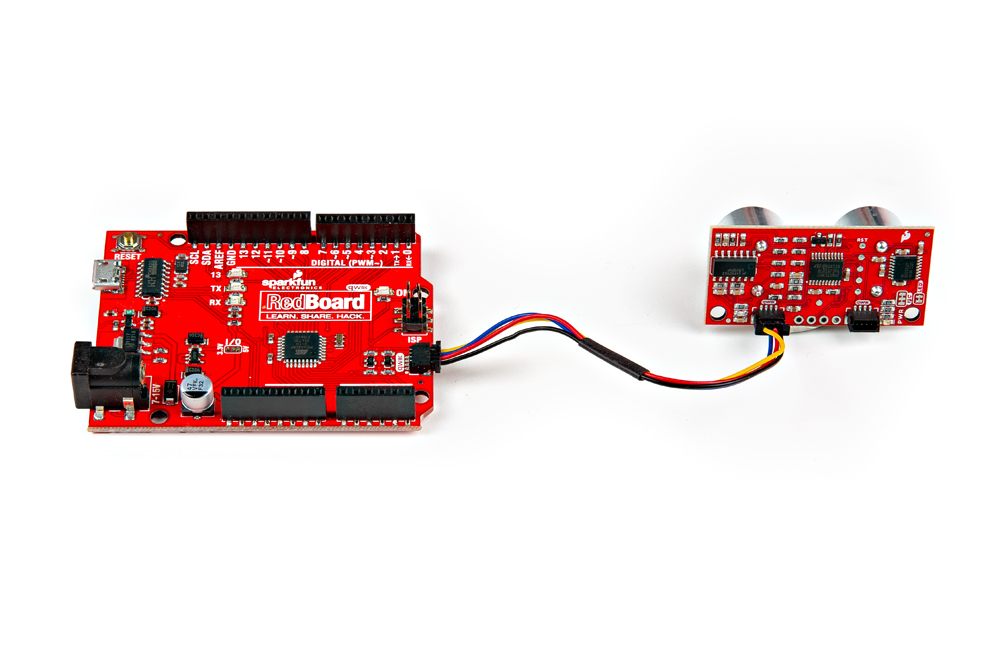

Using the Qwiic system, assembling the hardware is simple. Connect the RedBoard to one of the Ultrasonic Distance Sensor Qwiic ports using your Qwiic cables. Then connect the RedBoard to your computer via the MicroUSB cable and voila! You're ready to rock! 

<figure markdown>
[{ width="80%" }](assets/img/24805-Ultrasonic-Distance-Sensor-Action-2.jpg "Click to enlarge")
<figcaption markdown>Ultrasonic Distance Sensor Connected to Programming</figcaption>
</figure>

If you don't want to use the Qwiic system, there are Plated Through Holes on the side of the board that you can solder headers to. 

??? note "New to soldering?"
	If you have never soldered before or need a quick refresher, check out our [How to Solder: Through-Hole Soldering](https://learn.sparkfun.com/tutorials/how-to-solder-through-hole-soldering) guide.

	

	-   <a href="https://learn.sparkfun.com/tutorials/5">
		<figure markdown>
		
		</figure>

		---
		
		**How to Solder: Through-Hole Soldering**</a>

	

