 
Overall Features:

* Operating Voltage 3.3V
* Detecting Angle: 80 degrees
* Sensor range: 0.2 to 18m
* MCU on board: STM8L051F3
* 7 bit Unshifted Address: 0x2F
* Dimensions: 1.75" x 0.85"

## STM8L051F3 MCU

The 8-bit ultra-low power STM8 MCU Core provides increased processing power (up to 16 MIPS at 16 MHz) while maintaining the advantages of a CISC architecture with improved code density, a 24-bit linear addressing space and an optimized architecture for low power operations. It also features embedded data EEPROM and low power, low-voltage, single-supply program Flash memory. The device incorporates an extensive range of enhanced I/Os and peripherals, a 12-bit ADC, a real-time clock, two 16-bit timers, one 8-bit timer, as well as standard communication interfaces such as an SPI, an I2C interface, and one USART. For more information, refer to the [datasheet](assets/component_documentation/stm8l051f3-1.pdf).

<figure markdown>
[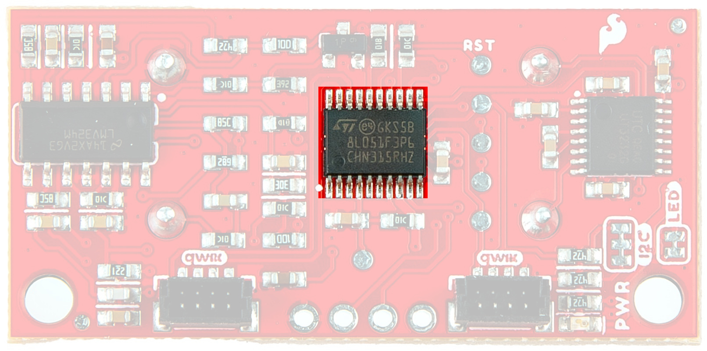{ width="600" }](assets/img/24805_SparkFun_Ultrasonic_Distance_Sensor-STM8L051F3.jpg "Click to enlarge")
<figcaption markdown>STM8L051F3 MCU</figcaption>
</figure>

## TCT40-16R/T

The TCT40-16R and TCT40-16RT are an analog ultrasonic receiver and transmitter featuring a distance range from 0.2 to 18 meters and a beam angle of 80°. We've attached an RS232 transceiver to the transmitter to boost the signal being sent out, and the receiver goes through an LMV324 op-amp to clean up the signal coming in for optimum detection. For more information, refer to the translated datasheet [here](assets/component_documentation/TCT40-16-T-R.pdf).

<figure markdown>
[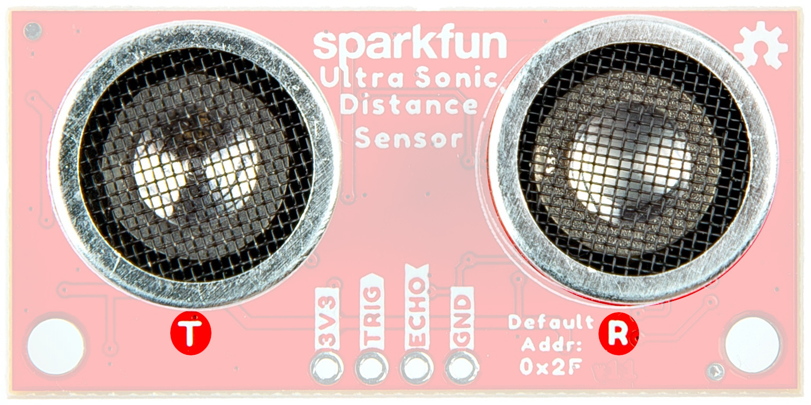{ width="600" }](assets/img/24805_SparkFun_Ultrasonic_Distance_Sensor-TCT40-16TR.jpg "Click to enlarge")
<figcaption markdown>TCT40-16R/T</figcaption>
</figure>

## Qwiic connectors

Our Qwiic Ecosystem makes sensors pretty much plug and play. There are two Qwiic connectors on the side of the Qwiic Distance Sensor board to provide power and I2C connectivity simultaneously. The default I2C address is 0x2F. The `updateAddress()` function allows you to change the I2C address to any address from 0x08 to 0x7F. More information on our Qwiic Ecosystem [can be found here](https://www.sparkfun.com/qwiic).  

<figure markdown>
[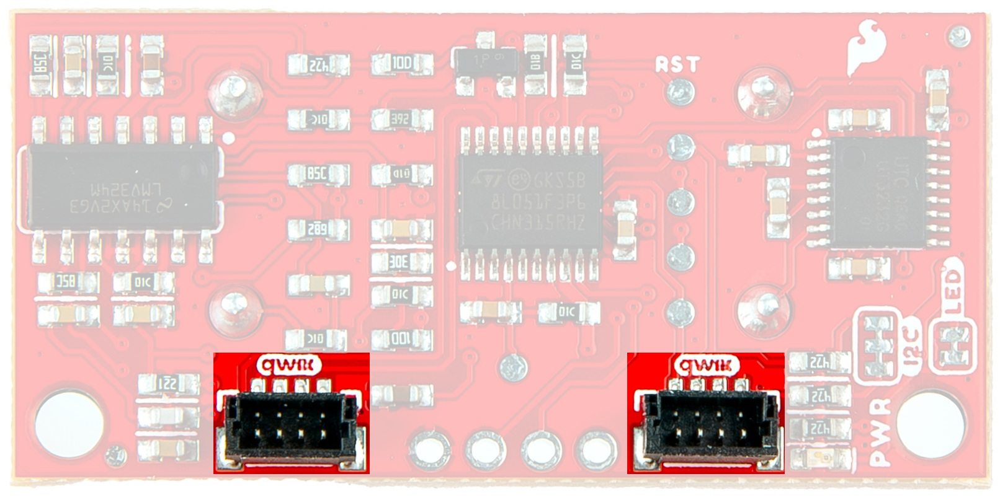{ width="600" }](assets/img/24805_SparkFun_Ultrasonic_Distance_Sensor-QwiicConnex.jpg "Click to enlarge")
<figcaption markdown>Qwiic connectors</figcaption>
</figure>

## Power

Ideally, power will be supplied via the Qwiic connectors on either side of the board. Alternatively, power can be supplied through the pins along the bottom side of the board labeled `3V3` and `GND`. The input voltage range should be between <b>1.8</b>-<b>3.6V</b>. 

<figure markdown>
[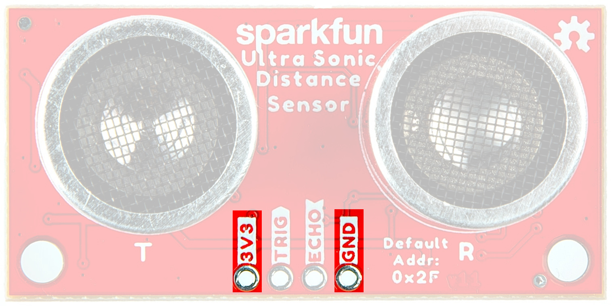{ width="600" }](assets/img/24805_SparkFun_Ultrasonic_Distance_Sensor-PowerPins.jpg "Click to enlarge")
<figcaption markdown>Power Pins</figcaption>
</figure>

## Trigger and Echo Pins

The Trigger and Echo pins are available as plated through holes to manually calculate the distance using the Ultrasonic Distance Sensor. To use, pull TRIG HIGH and then LOW, wait for the ECHO pin to go HIGH and then take the time in between to calculate the distance to the object. For more information on how this works, check out Example 3 later in this guide. 

<figure markdown>
[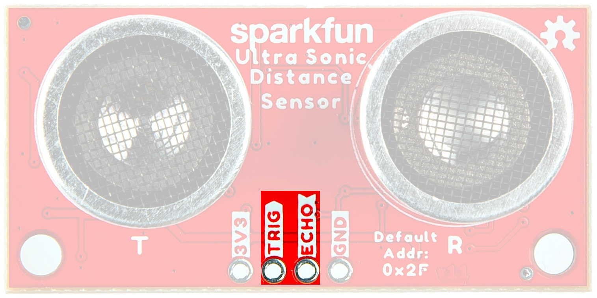{ width="600" }](assets/img/24805_SparkFun_Ultrasonic_Distance_Sensor-TriggerandEcho.jpg "Click to enlarge")
<figcaption markdown>Trigger and Echo Pins</figcaption>
</figure>

## Testpoint Pads

We've provided a number of open pads on the back of the board.

### I2C Pads

Should you wish to avoid using the Qwiic connectors, you can use these two pads (along with the power PTH pins) to still take advantage of the I2C communication protocols. 

<figure markdown>
[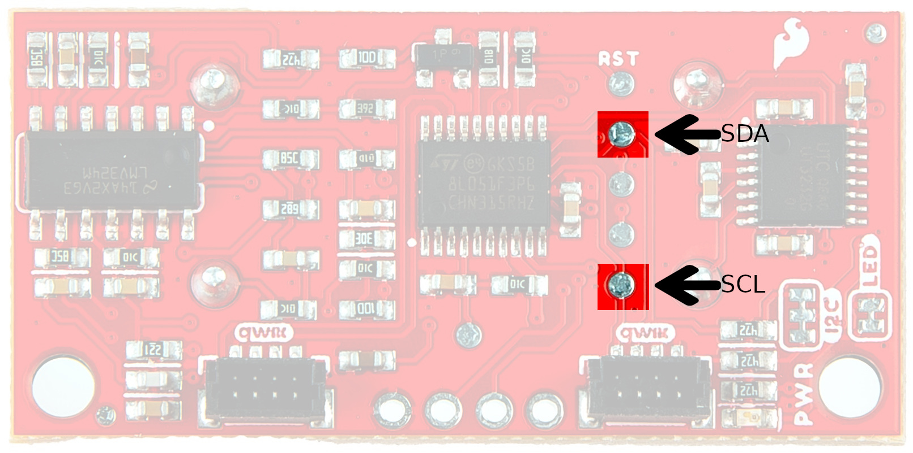{ width="600" }](assets/img/24805_SparkFun_Ultrasonic_Distance_Sensor-I2CPads.jpg "Click to enlarge")
<figcaption markdown>I2C Testpoint Pads</figcaption>
</figure>

### Single Wire Interface Module (SWIM)

SWIM, INT, and NRST are all part of the "Single Wire Interface Module (SWIM)" used for programming the onboard STM8 microcontroller and for most users, can be effectively ignored. For those who wish to dive into the deep end and tweak the firmware, these pads are available. Requirements include ST Visual Develop (the ST Progamming Software bundled with Visual Develop), a COSMIC compiler license, and a USB to SWIM adapter.

<figure markdown>
[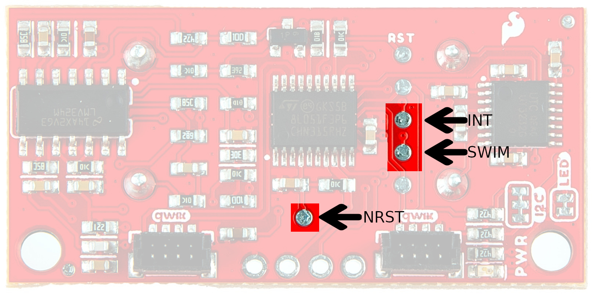{ width="600" }](assets/img/24805_SparkFun_Ultrasonic_Distance_Sensor-SWIMPads.jpg "Click to enlarge")
<figcaption markdown>SWIM Testpoint Pads</figcaption>
</figure>

### ADDR_RST 

ADDR_RST resets the address to 0x2F. 

<figure markdown>
[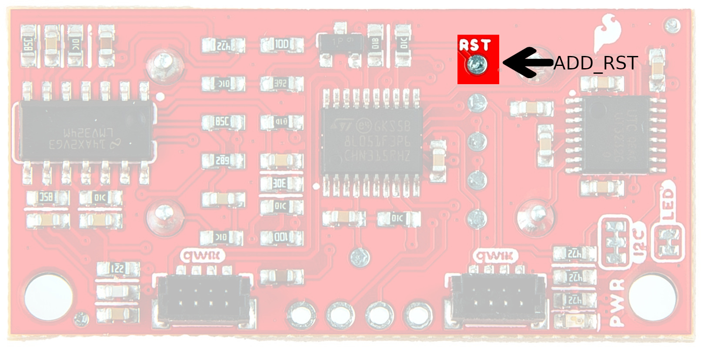{ width="600" }](assets/img/24805_SparkFun_Ultrasonic_Distance_Sensor-ADDR_RSTPads.jpg "Click to enlarge")
<figcaption markdown>ADDR_RST Testpoint Pad</figcaption>
</figure>

## Jumpers

??? note "Never modified a jumper before?"
	Check out our <a href="https://learn.sparkfun.com/tutorials/664">Jumper Pads and PCB Traces tutorial</a> for a quick introduction!
	

		<a href="https://learn.sparkfun.com/tutorials/664">
		 
        How to Work with Jumper Pads and PCB Traces</a>
	

### LED Jumper

If you are concerned about power consumption, need to run dark, or you just don't like LEDs, cut the traces here to disconnect the Power LED from, you guessed it, power. 

<figure markdown>
[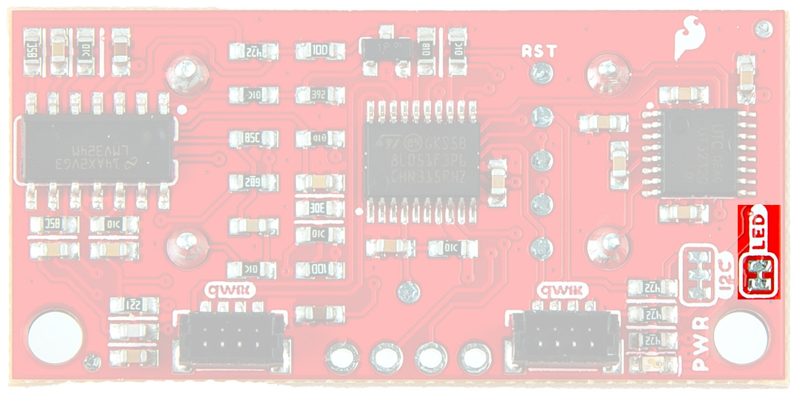{ width="600" }](assets/img/24805_SparkFun_Ultrasonic_Distance_Sensor-LEDJumper.jpg "Click to enlarge")
<figcaption markdown>LED Jumper</figcaption>
</figure>

### I2C

The Qwiic Ultrasonic Distance Sensor has built-in 2.2k pull-up resistors on the SDA and SCL lines. These are needed for normal I2C communication. The I2C jumper has two small traces connecting the pull-ups to 3.3V. **For general use you can leave this jumper unmodified.** If you have many (over 7) devices on the I2C bus, each with their own pull up resistors, then you may want to [cut the I2C jumpers](https://learn.sparkfun.com/tutorials/how-to-work-with-jumper-pads-and-pcb-traces) to disconnect the 2.2k resistors on each Qwiic board.

<figure markdown>
[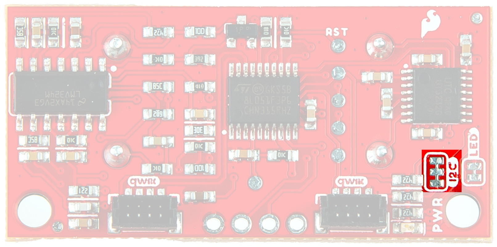{ width="600" }](assets/img/24805_SparkFun_Ultrasonic_Distance_Sensor-I2CJumper.jpg "Click to enlarge")
<figcaption markdown>I2C jumper</figcaption>
</figure>

## Board Dimensions

The board dimensions are illustrated in the drawing below; the listed measurements are in inches.

<figure markdown>
[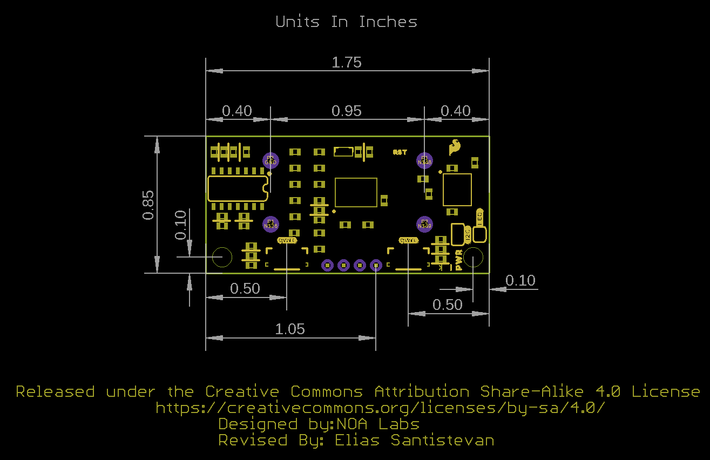{ width="600" }](assets/board_files/SparkFun_Ultrasonic_Sensor_BoardOutline.png "Click to enlarge")
<figcaption markdown>SparkFun Ultrasonic Sensor Board Dimensions</figcaption>
</figure>

??? tip "Need more measurements?"
	For more information about the board's dimensions, users can download the [Eagle files](SparkFun_Ultrasonic_Sensor_EagleFiles.zip). These files can be opened in Eagle and additional measurements can be made with the dimensions tool.

	??? info ":octicons-download-16:{ .heart } Eagle - Free Download!"
		Eagle is a [CAD]("computer-aided design") program for electronics that is free to use for hobbyists and students. However, it does require an account registration to utilize the software.

		

		[Download from :autodesk-primary:{ .autodesk }](https://www.autodesk.com/products/eagle/free-download "Go to downloads page"){ .md-button .md-button--primary width="250px" }
		

	
	??? info ":straight_ruler: Dimensions Tool"
		This video from Autodesk demonstrates how to utilize the dimensions tool in Eagle, to include additional measurements:

		

		

		<iframe src="https://www.youtube.com/embed/dZLNd1FtNB8" title="EAGLE Dimension Tool" frameborder="0" allow="accelerometer; autoplay; clipboard-write; encrypted-media; gyroscope; picture-in-picture" allowfullscreen></iframe>
		

		

